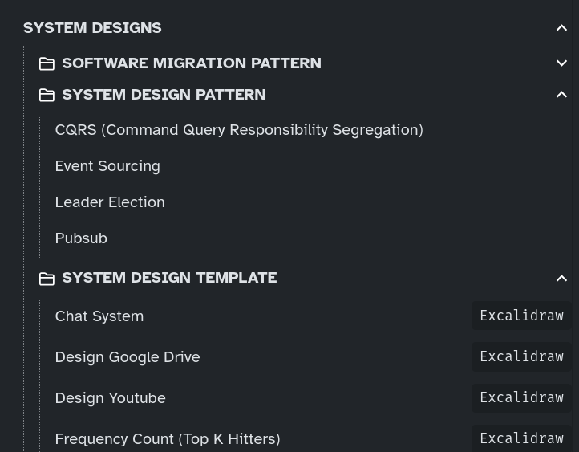
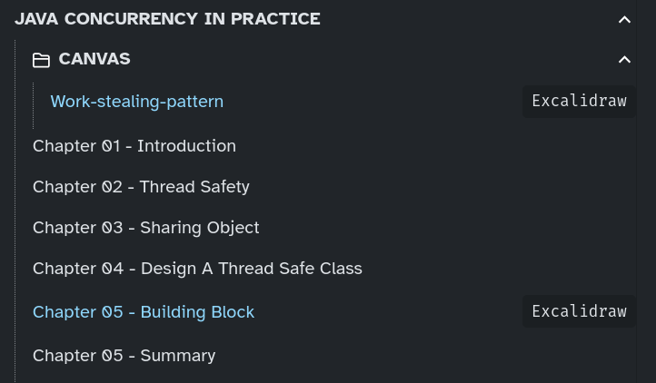
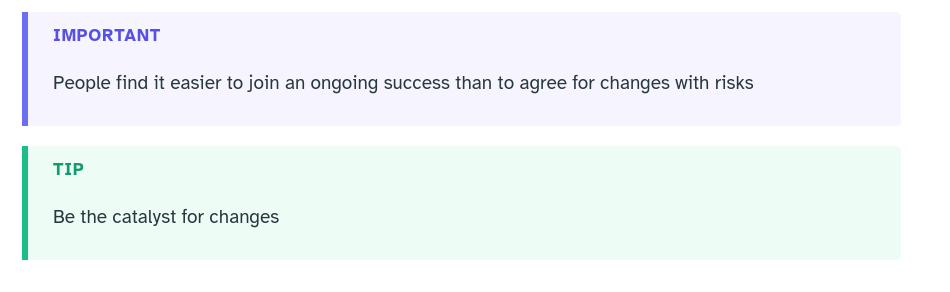
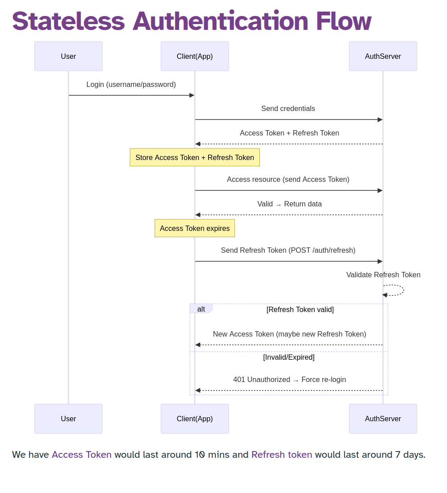

Live: [https://swe.auspham.dev/](https://swe.auspham.dev/)

# This fork has

1. Nested preview


2. Docs navigation previous/next


3. Nested folder structure supported. Thanks [@DoNotResuscitate](https://github.com/DoNotResuscitate/) for finding and fixing bugs

 


4. Obsidian Excalidraw (https://github.com/zsviczian/obsidian-excalidraw-plugin) supported with rendering, drag/zoom diagram


File that's excalidraw will be noted in the file tree




5. Native obsidian allout support




6. Mermaid support



> [!NOTE]
> Example page that has all these features: https://swe.auspham.dev/docs/java-concurrency-in-practice/chapter-05-building-block/

# If you're using this fork:

For this to work, please use this netlify.toml or change the one which is marked as `IMPORTANT`

This has been configured properly for page previous/next with the graph settings


```toml
[build]
command = "rm -rf __obsidian __site && git clone https://github.com/rockmanvnx6/obsidian-zola.git __site && __site/run.sh || true"
publish = "public"

[build.environment]
# (Optional) Text in landing page button
LANDING_BUTTON = "Go to notes"
# (Optional) Site description on landing page
LANDING_DESCRIPTION = "Contains AWS, system design, and some random stuff"
# (REQUIRED) The Markdown page linked to landing page button (e.g. put home for ./home.md)
LANDING_PAGE = "home"
# (Optional) Site title on landing page
LANDING_TITLE = "My SWE notes 💖"
PYTHON_VERSION = "3.8"
# (REQUIRED) Site repo URL
REPO_URL = "https://github.com/rockmanvnx6/notes"
# (Optional) Site title in navbar
SITE_TITLE = "Austin's SWE Notes 😭"
# (Optional) Site title in browser tab (leave blank to use SITE_TITLE)
SITE_TITLE_TAB = ""
# (REQUIRED) Netlify site URL
SITE_URL = "https://swe.auspham.dev/"
# (Optional) Site Timezone
TIMEZONE = "Australia/Melbourne"
GITHUB_LINK = "https://github.com/auspham/obsidian-zola"
HOMEPAGE_URL = "https://auspham.dev"
ZOLA_VERSION = "0.15.2"
# (Optional, default title) How to sort notes inside each section on the right sidebar ("date" or "title"). Subsections on side bar are sorted by title, the sort order cannot be changed.
SORT_BY = "weight"
# (Optional) Google Analytics Measurement ID
GANALYTICS = ""
# (Optional, default true) Slugify URLs. Put "" to disable.
SLUGIFY = "y"
# (Optional, default true) Shows knowledge graph on home page. Put "" to disable.
HOME_GRAPH = "y"
# (Optional, default true) Shows knowledge graph on every page. Put "" to disable.
PAGE_GRAPH = "y"
# (Optional, default false) Whether sidebar sections should be collapsed by default.
SIDEBAR_COLLAPSED = "true"
# (Optional, default blank) Additional footer content.
FOOTER = ""
# (Optional, default main) Root section name.
ROOT_SECTION_NAME = "main"
# (Optional) visjs graph options. Can remove if desired.
GRAPH_OPTIONS = """
        {
			autoResize: true,
        	nodes: {
        		shape: "dot",
        		color: isDark() ? "#8c8e91" : "#dee2e6",
        		font: {
        			face: "Inter",
        			color: isDark() ? "#c9cdd1" : "#616469",
        			strokeColor: isDark() ? "#c9cdd1" : "#616469",
        		},
        		scaling: {
        			label: {
        				enabled: true,
        			},
        		},
        	},
        	edges: {
        		color: { inherit: "both" },
        		width: 0.8,
        		smooth: {
        			type: "continuous",
				roundness: 1
        		},
        		hoverWidth: 4,
        	},
        	interaction: {
        		hover: true,
        	},
        	height: "100%",
        	width: "100%",
        	physics: {
				solver: "forceAtlas2Based",
				stabilization: false
        	},
        }
        """

```